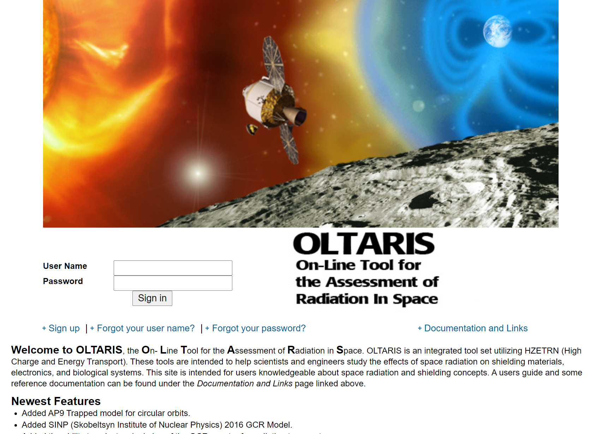

# Summary

A directed acyclic graph (DAG) comprises vertices connected by edges along which
no cyclic paths exist.  DAG resulted from a refactoring and updating
[DAGLIB](https://github.com/jacobwilliams/daglib) to leverage the increased
modularity, explicit parallelism, purely functional capabilities of Fortran
2018.

# Statement of need

Our primary interest lies in parallel task scheduling for the On-Line Tool for
Assessment of Radiation in Space (OLTARIS, Figure \autoref{fig:oltaris})
[@singleterry2011oltaris].  We are publishing both the task scheduling framework
and DAG as open-source to make them available to the broader Fortran community
for use in any applications that require a DAG abstraction.

# Acknowledgements

We acknowledge contributions from Brigitta Sipocz, Syrtis Major, and Semyeong
Oh, and support from Kathryn Johnston during the genesis of this project.

# References
